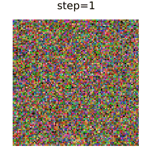
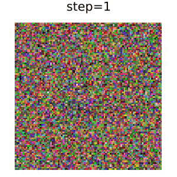

# DDIM.jl

[Lux.jl](https://github.com/avik-pal/Lux.jl) implementation of Denoising Diffusion Implicit Models ([arXiv:2010.02502](https://arxiv.org/abs/2010.02502)).

The implementation follows [the Keras example](https://keras.io/examples/generative/ddim/).



# Usage

## Dataset
Download `Dataset images` from [102 Category Flower Dataset](https://www.robots.ox.ac.uk/~vgg/data/flowers/102/).


## Training
```bash
$julia --project train.jl \
    --epochs 25 \
    --image-size 96 \
    --batchsize 64 \
    --learning-rate 1e-3 \
    --weight-decay 1e-4 \
    --val-diffusion-steps 80 \
    --dataset-dir oxford_flower_102 \ # path to dataset
    --output-dir output/train # path to save checkpoint and images
```
You can also change model hyper parameters. See `main` function in `train.jl`.

## Image generation
```bash
$julia --project generate.jl \
    ./output/ckpt/checkpoint_25.bson \ # path to checkpoint
    --image-size 96 \
    --num-images 10 \
    --diffusion-steps 80 \
    --output-dir output/generate # path to save images
```
You can also change model hyper parameters. See `main` function in `generate.jl`.
The hyper parameters should be the same during training and generation.
